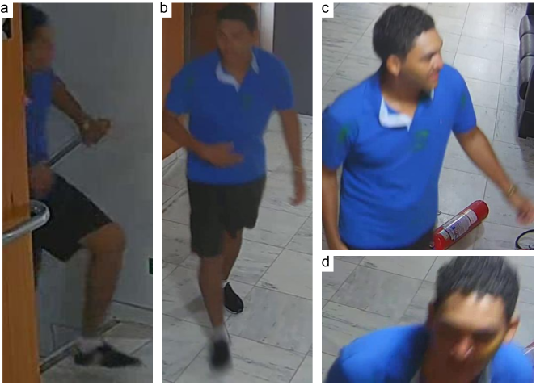

# UFPR-Planalto801


This dataset, called UFPR-Planalto801 dataset, has been introduced in our VISAPP paper [[PDF]](./VISAPP_2024_370.pdf) and contains images of a real-world surveillance scenario and it is mainly intended for use in the development of security systems, specially regarding people tracking and re-identification.
It is composed by videos taken from cameras inside the the Palácio do Planalto, in Brazil, during protesters invasion on January 8, 2023. These videos are part of the footage released to the public by the Brazilian Supreme Court, according to the [GSI Note](https://www.gov.br/gsi/pt-br/centrais-de-conteudo/noticias/2023-1/nota-a-imprensa-acesso-as-imagens-do-dia-08-01-2023-do-circuito-interno-de-seguranca-do-palacio-do-planalto) released to the press on April 23, 2023. (last access: January 15,2024). The complete footage is available for download through this [link](https://drive.presidencia.gov.br/public/615ba7).


The UFPR-Planalto801 dataset contains 14 videos of several lengths, with a resolution of 1920x1080 pixels and encoded to 24 FPS. There are approximately 6 hours of video, with a total of 518,050 frames and 510,471 annotated detections. Details are presented in the table below.


| Videos  | Frames | Duration | Detections | Tracks |
|:-------:|:------:|:--------:|:----------:|:------:|
| Video01 | 24119  | 0:16:44  | 7438       | 28     |
| Video02 | 6743   | 0:04:40  | 25686      | 79     |
| Video03 | 10811  | 0:07:30  | 31246      | 52     |
| Video04 | 41850  | 0:29:03  | 42537      | 68     |
| Video05 | 42361  | 0:29:25  | 89531      | 95     |
| Video06 | 42857  | 0:29:45  | 83949      | 46     |
| Video07 | 38164  | 0:26:30  | 33582      | 28     |
| Video08 | 34313  | 0:23:49  | 33191      | 19     |
| Video09 | 16997  | 0:11:48  | 4046       | 15     |
| Video10 | 81956  | 0:56:54  | 104509     | 167    |
| Video11 | 78907  | 0:54:47  | 27686      |  80    |
| Video12 | 79464  | 0:55:11  | 15788      |  38    |
| Video13 | 560    | 0:00:23  | 1025       |  2     |
| Video14 | 18948  | 0:13:09  | 10257      |  19    |
| **Total**   | **518050** | **5:59:38**  | **510471**     | **736**    |


Annotations are in MOTChallenge format (https://motchallenge.net/):

```
<frame>,<id>,<left>,<top>,<width>,<height>,<conf>,<x>,<y>,<z>
```

```
UFPR-PLanalto801
├── all
│   ├── VIDEO-01
│   │   │── gt
│   │   |   └── gt.txt
│   │   │── img1
│   │       ├── 000001.jpg
│   │       ├── 000002.jpg
│   │       ├── 000003.jpg
│   │       ├── 000004.jpg
...
│   ├── VIDEO-02
│   │   │── gt
│   │   |   └── gt.txt
│   │   │── img1
│   │       ├── 000001.jpg
│   │       ├── 000002.jpg
│   │       ├── 000003.jpg
│   │       ├── 000004.jpg
...
```


Here are some frames from the dataset:  

<br>


Here are some examples of people framing from the dataset:  
<p align="center">

<br>
</p>

Here are some examples of tracklets from the dataset:  
<p align="center">


<br>
</p>

The full details are in our [paper](./VISAPP_2024_370.pdf).

## How to obtain the dataset

The UFPR-Planalto801 dataset annotations are released for academic research only and is free to researchers from educational or research institutes for non-commercial purposes.

We extract pieces of a public footage in order to produce the The UFPR-Planalto801 dataset. We annotated the positions of people in frames, since original images have no annotations.

You can access the complete footage through this [link](https://drive.presidencia.gov.br/public/615ba7), but before you can download the dataset annotations, we kindly ask you to register by sending an e-mail with the following subject: “UFPR-Planalto801 Dataset” to the first author [cristianobac@ufc.br], so that we can know who is using the provided data and notify you of future updates. Please include your name, affiliation and department in the e-mail. Once you have registered, you will receive a link to download the database. In general, a download link will take 1-3 workdays to issue.


## Citation

If you use the UFPR-Planalto801 dataset in your research, please cite our paper:


* de Oliveira, C.; Neves, J.; Ribeiro, R. and Menotti, D. (2024). A Multilevel Strategy to Improve People Tracking in a Real-World Scenario.  In Proceedings of the 19th International Joint Conference on Computer Vision, Imaging and Computer Graphics Theory and Applications - Volume 4: VISAPP, ISBN 978-989-758-679-8, ISSN 2184-4321, pages 130-137.    


Additionally, consider showing your support by starring this repository.

## Related publications
```
@InProceedings{OliveiraNeveRibeMeno:2023:PeTrMe,
               author = "Oliveira, Cristiano Bacelar de and Neves, Jo{\~a}o C. and 
                         Ribeiro, Rafael O. and Menotti, David",
                title = "People Tracking Methods Applied to Planalto Palace Security 
                         Videos",
            booktitle = "Proceedings...",
                 year = "2023",
               editor = "Clua, Esteban Walter Gonzalez and K{\"o}rting, Thales Sehn and 
                         Paulovich, Fernando Vieira and Feris, Rogerio",
         organization = "Conference on Graphics, Patterns and Images, 36. (SIBGRAPI)",
  conference-location = "Rio Grande, RS",
      conference-year = "Nov. 06-09, 2023",
             language = "en",
                  ibi = "8JMKD3MGPEW34M/49SPD9L",
                  url = "http://urlib.net/ibi/8JMKD3MGPEW34M/49SPD9L",
           targetfile = "Sibgrapi_2023___WiP__Camera_Ready_.pdf",
        urlaccessdate = "2024, Jan. 30"
}
```


## Contact

Please contact Cristiano B. de Oliveira ([cristianobac@ufc.br](mailto:cristianobac@ufc.br)) with questions or comments.


## Acknowledgments

This work was supported in part by the Coordination for the Improvement of Higher Education Personnel (CAPES) (Programa de Cooperação Acadêmica em Segurança Publica e Ciências Forenses # 88881.516265/2020-01), and in part by the National Council for Scientific and Technological Development(CNPq) (# 308879/2020-1). We gratefully acknowledge the support of NVIDIA Corporation with the donation of the Quadro RTX 8000 GPU used for this research.

We also would like to thank the Universidade Federal do Paraná and the Universidade Federal do Ceará, in Brazil, for the support provided throughout this project.


## Disclaimer

The construction of this dataset is not motivated by political issues. 
The main interest in this footage arises from the real-world surveillance scenario it depicts.
