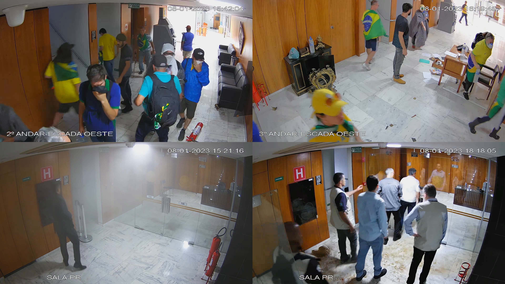

# UFPR-Planalto801


This dataset, called UFPR-Planalto801 dataset, has been introduced in our VISAPP paper [[PDF]](./VISAPP_2024_370.pdf) and contains images of a real-world surveillance scenario and it is mainly intended for use in the development of security systems, specially regarding people tracking and re-identification.
It is composed by videos taken from cameras inside the the Palácio do Planalto, in Brazil, during protesters invasion on January 8, 2023. These videos are part of the footage released to the public by the Brazilian Supreme Court, according to the [GSI Note](https://www.gov.br/gsi/pt-br/centrais-de-conteudo/noticias/2023-1/nota-a-imprensa-acesso-as-imagens-do-dia-08-01-2023-do-circuito-interno-de-seguranca-do-palacio-do-planalto) released to the press on April 23, 2023. (last access: January 15,2024). The complete footage is available for download through this [link](https://drive.presidencia.gov.br/public/615ba7).


The UFPR-Planalto801 dataset contains 14 videos of several lengths, with a resolution of 1920x1080 pixels and encoded to 24 FPS. There are approximately 6 hours of video, with a total of 518,050 frames and 510,471 annotated detections. Details are presented in the table below.


| Videos  | Frames | Duration | Detections | Tracks |
|:-------:|:------:|:--------:|:----------:|:------:|
| Video01 | 24119  | 0:16:44  | 7438       | 28     |
| Video02 | 6743   | 0:04:40  | 25686      | 79     |
| Video03 | 10811  | 0:07:30  | 31246      | 52     |
| Video04 | 41850  | 0:29:03  | 42537      | 68     |
| Video05 | 42361  | 0:29:25  | 89531      | 95     |
| Video06 | 42857  | 0:29:45  | 83949      | 46     |
| Video07 | 38164  | 0:26:30  | 33582      | 28     |
| Video08 | 34313  | 0:23:49  | 33191      | 19     |
| Video09 | 16997  | 0:11:48  | 4046       | 15     |
| Video10 | 81956  | 0:56:54  | 104509     | 167    |
| Video11 | 78907  | 0:54:47  | 27686      |  80    |
| Video12 | 79464  | 0:55:11  | 15788      |  38    |
| Video13 | 560    | 0:00:23  | 1025       |  2     |
| Video14 | 18948  | 0:13:09  | 10257      |  19    |
| **Total**   | **518050** | **5:59:38**  | **510471**     | **736**    |


Annotations are in [MOTChallenge] (https://motchallenge.net/)

```
<frame>,<id>,<left>,<top>,<width>,<height>,<conf>,<x>,<y>,<z>
```


Here are some frames from the dataset:  

<br>


Here are some examples of people framing from the dataset:  
<p align="center">

<br>
</p>

Here are some examples of tracklets from the dataset:  
<p align="center">


<br>
</p>

The full details are in our [paper](./VISAPP_2024_370.pdf).

## How to obtain the dataset

The UFPR-Planalto801 dataset is released for academic research only and is free to researchers from educational or research institutes for **non-commercial purposes**. 

To be able to download the dataset, please read carefully [**this license agreement**](./pdfs/license-agreement.pdf), fill it out, and send it back to the first author ([cristianobac@ufc.br](mailto:cristianobac@ufc.br)). **Your e-mail must be sent from a valid university account** (.edu, .ac or similar).

In general, you will receive a download link within 1-5 business days. Failure to follow the instructions may result in no response.


## Citation

If you use the UFPR-Planalto801 dataset in your research, please cite our paper:

* C. B. de Oliveira, J. C. Neves, R. O. Ribeiro and D. Menotti, “A Multilevel Strategy to Improve People Tracking in a Real-World Scenario” in *International Conference on Computer Vision Theory and Applications (VISAPP)*, Feb 2024. [[arXiv]](https://) 

```
```


Additionally, consider showing your support by starring (:star:) this repository.

## Related publications


## Contact

Please contact Cristiano B. de Oliveira ([cristianobac@ufc.br](mailto:cristianobac@ufc.br)) with questions or comments.


## Acknowledgments

This work was supported in part by the Coordination for the Improvement of Higher Education Personnel (CAPES) (Programa de Cooperação Acadêmica em Segurança Publica e Ciências Forenses # 88881.516265/2020-01), and in part by the National Council for Scientific and Technological Development(CNPq) (# 308879/2020-1). We gratefully acknowledge the support of NVIDIA Corporation with the donation of the Quadro RTX 8000 GPU used for this research.

We also would like to thank the Universidade Federal do Paraná and the Universidade Federal do Ceará, in Brazil, for the support provided throughout this project.


## Disclaimer

The construction of this dataset is not motivated by political issues. 
The main interest in this footage arises from the real-world surveillance scenario it depicts.
